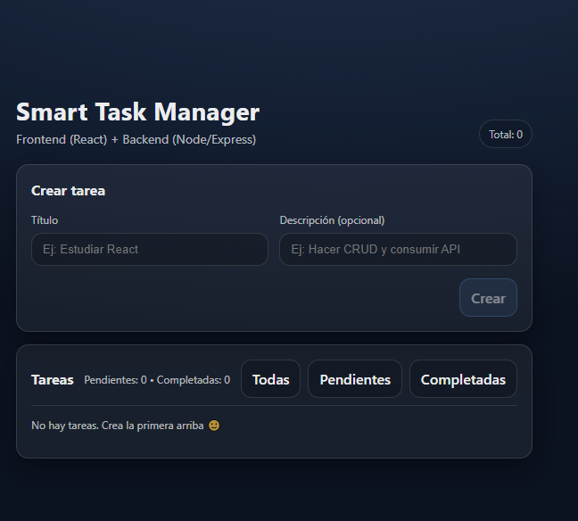
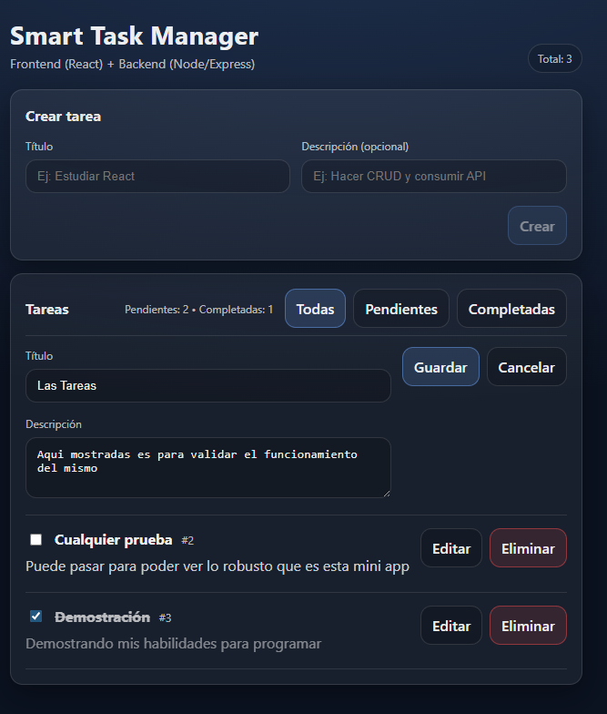
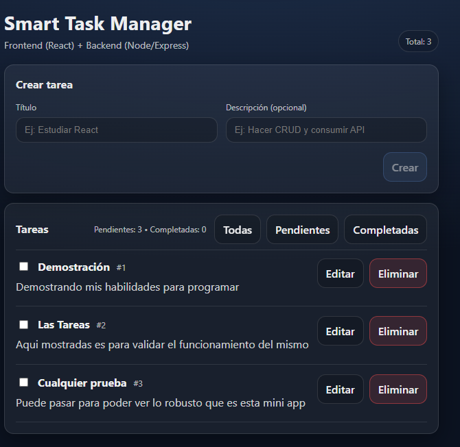
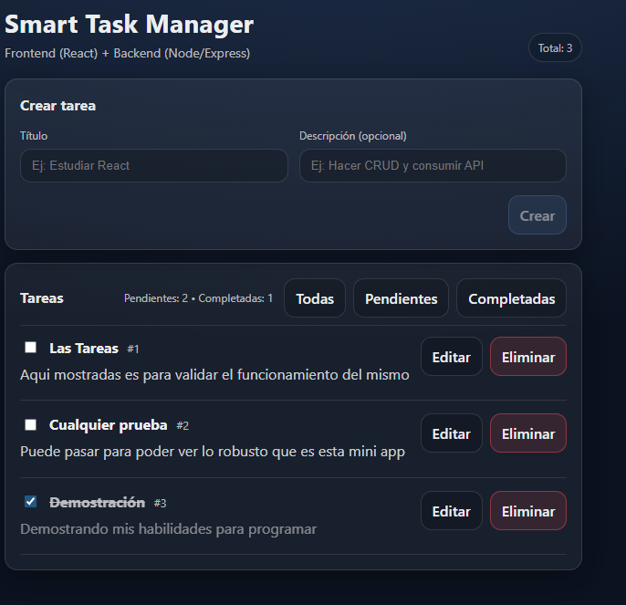
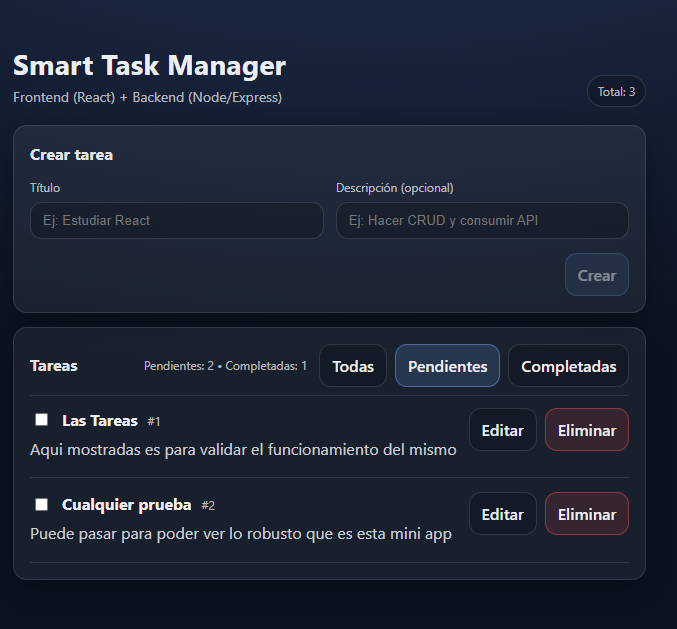
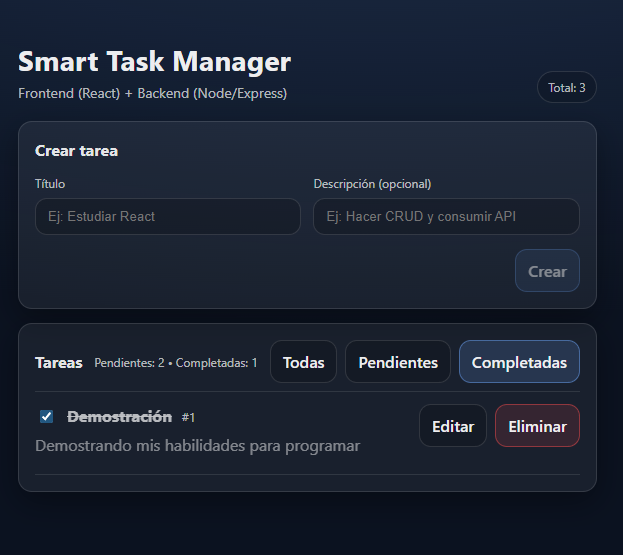

# 🧠 Smart Task Manager

Aplicación Full Stack para gestión de tareas desarrollada con **React**, **Node.js**, **Express** y **SQLite**, completamente dockerizada usando **Docker Compose**.

Permite crear, editar, eliminar y marcar tareas como completadas, con una interfaz moderna y responsiva.

---

## 🚀 Funcionalidades

✅ CRUD completo de tareas  
✅ Edición inline  
✅ Marcar tareas como completadas  
✅ Filtros (Todas / Pendientes / Completadas)  
✅ Orden automático de tareas  
✅ UI moderna y responsiva  
✅ Backend REST API  
✅ Dockerización completa  

---

## 🛠️ Stack Tecnológico

### Frontend
- React + Vite
- JavaScript (ES6+)
- CSS moderno (custom)
- Fetch API

### Backend
- Node.js
- Express
- SQLite
- REST API

### DevOps
- Docker
- Docker Compose

---

## 📦 Instalación Local (sin Docker)

### Requisitos
- Node.js 18+

---

### ⚙️Backend

Desde la raíz del proyecto:

bash
npm install
node src/app.js

### Servidor disponible en:
http://localhost:3000

### 🌐 Frontend
cd frontend
npm install
npm run dev
Aplicación disponible en:
http://localhost:5173

### 🐳 Ejecutar con Docker

Requisitos

Docker Desktop instalado

Desde la raíz del proyecto:

docker compose up --build

### Frontend: 
http://localhost:5173

### Backend (health check):
http://localhost:3000/health

## Para detener los contenedores:
docker compose down 

### 🏗️ Arquitectura

### 📸 Capturas

### Vista principal

### Edición de tareas

## Tareas Agregadas

## Tarea Completada vista principal

## Tareas Pendientes filtro

## Tareas Completada filtro

### 👨‍💻 Autor

Andrés Espinosa
Software Developer
Ecuador 🇪🇨

### 📄 Licencia

MIT License
ask-manager
